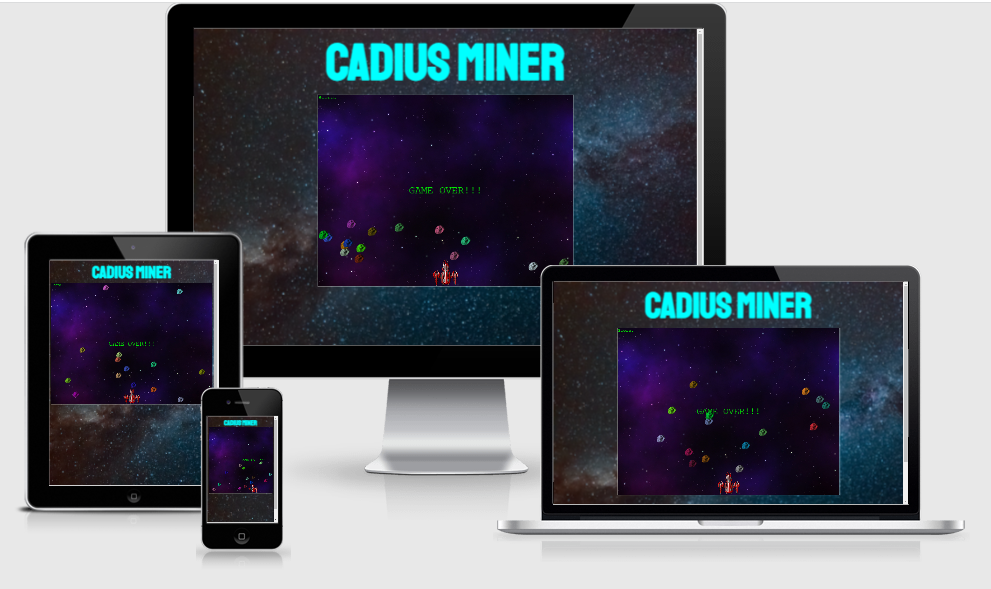
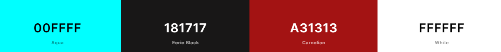

# Cadius Miner
Cadius Miner is a fun interactive space ship shooter game. The game allows players to score as many points as they can until by mining asteroids. 

to visit the live version of the game (hosted by Github Pages) click [here](https://robcole-dev.github.io/cadius-miner/)

## User Stories
 - A section for how to play
 - A section to display a score
 - A ship that shoots
 - Asteroids that float from the top down
 - A game over screen 

## UX
The UX has a space style theme, which is consistant on both pages.

### Colour Scheme 
The colour scheme used for the site and game is a mixture of Aqua, white, dark grey, red and green.

### Typography 
On the site I have used 2 fonts found on Google fonts.

Links to the fonts used:

[Kanit](https://fonts.google.com/specimen/Kanit) - Font used for Play link

[Staatliches](https://fonts.google.com/specimen/Staatliches) - Font used for Headings

### Wireframes and Designs

Below are a couple of screenshots of Wireframes created for this project.

## Features 

Below are a list of key features and future features.

### Existing Features
- __The Landing Page__

 - The landing page includes a how to guide for people visiting the site and a Play link to the game.
 - The How To Play link displays or hides a text field with instructions in.

- __The Game Page__

 - The game page is kept clean and simple.
 - The game uses a framework called Phaser, the version used is 3.

- __The Game__

 - The game has 2 types of control built in. 1 is the mouse which drags the ship from left to right, the other is the arrow keys on a keyboard.
 - The game keeps track of the players score in the top right corner.

### Features Left to Implement

- __High Scores__

 - A high scores table that will keep track of the top 10 high scores.

- __Power ups__

 - Powers to be collected in the game to allow an asortment of things such as faster weapons or shields.

- __Lives__

 - Lives will give the player more of a chance to score lots of points.

- __Scenes__

 - Create a holding scene which will allow the player to view high scores or start the game.
 - Create a Game Over Scene so the player can enter their name if they manage to get on the high scores table.

## Technologies Used

During the developemnt of the site and game a number of programs and web based applications were used. You can find a list of these below:

[Balsamiq Wireframes](https://balsamiq.com/) - Used to create the wireframes

[Github](https://github.com/) - Used to host the project

[Gitpod](https://www.gitpod.io/) - Used as a cloud based IDE to code the project

[GIT](https://en.wikipedia.org/wiki/Git) - Used for version control

[Phaser Framwork](https://phaser.io/) - Used for the game framework

The codes that was used to develop the site and game are:

[HTML5](https://en.wikipedia.org/wiki/HTML5)

[CSS3](https://en.wikipedia.org/wiki/CSS)

[JavaScript](https://en.wikipedia.org/wiki/JavaScript)

## Testing

For all testing, please refer to the [TESTING.md](TESTING.md) file.

## Deployment

 The site was deployed to GitHub pages. The steps to deploy are as follows: 
 - In the GitHub repository, navigate to the Settings tab 
 - From the source section drop-down menu, select the Main Branch 
 - Once the Main Branch has been selected, the page will be automatically refreshed with a detailed ribbon display to indicate the successful deployment. 

[Link to deployed site](https://robcole-dev.github.io/cadius-miner/)

### Local Deployment

If you would like to make a clone of this repository, you can type the following command in your IDE terminal:

- `git clone https://github.com/robcole-dev/cadius-miner.git`

Alternatively, if using Git pod, you can click below to create your own workspace using this repository.

## Credits 

### Content 

- The framework used for the game was Phaser [Phaser Framwork](https://phaser.io/)

### Media

The images used for the site and game
 - Background image [pexels](https://www.pexels.com/)
 - The ship [SeekPNG](https://www.seekpng.com/ipng/u2q8a9u2e6a9i1t4_spaceship-spaceship-spacecraft-game-design-concept-red-spaceship/)
 - The Asteroid [PNG EGG](https://www.pngegg.com/en/png-tsprz)

### Acknowledgments

- Tim (My Mentor)
- The community over at Phaser via their Discord server
