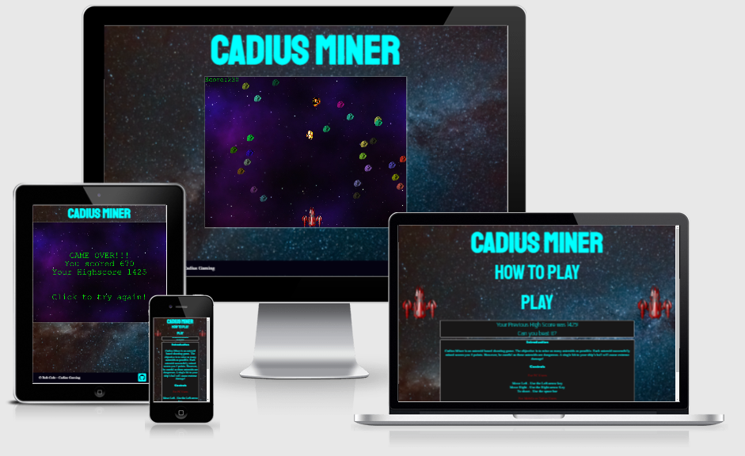
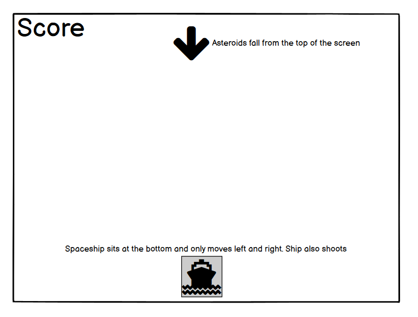

# Cadius Miner
Cadius Miner is a fun interactive space ship shooter game. The game allows players to score as many points as they can by mining asteroids. The game is over once a player has been hit by an asteroid.

To visit the live version of the game (hosted by Github Pages) click [here](https://robcole-dev.github.io/cadius-miner/)



## User Stories
 - As a user, I would like to see instructions on how to play
 - As a user, I want to be able to see my current score while playing the game
 - As a user, I want to be able to control when the character fires at the asteroids
 - As a user, I want the asteroids to float down from the top of the screen
 - As a user, I want a game over screen to appear when I have hit an asteroid

## UX
The UX has a space style theme, which is consistent on both pages.

### Colour Scheme 
The colour scheme used for the site and game is a mixture of Aqua, white, dark grey, red and green.

The red blends with the ship which has a retro space theme. The aqua blends with the blues in the background webpage. The dark grey and white and to keep with a space theme and blends nicely with the background. The green is only on the game canvas and keeps with the retro style of the game. The asteroids are an assortment of colours and to save on images used, I have used JS code to change the RGB value of the image.


### Typography 
On the site, I have used 2 fonts found on Google fonts.

Links to the fonts used:

[Kanit](https://fonts.google.com/specimen/Kanit) - Font used for Play link

[Staatliches](https://fonts.google.com/specimen/Staatliches) - Font used for Headings


### Wireframes and Designs

Below are a couple of screenshots of Wireframes created for this project.




## Features 

Below are a list of key features and future features.

### Existing Features
- __The Landing Page__

    - The landing page includes a how to guide for people visiting the site and a play link to the game.
    - The How To Play link displays or hides a text field with instructions in.


- __The Game Page__

    - The game page is kept clean and simple.
    - The game uses a framework called Phaser, the version used is 3.


- __The Game__

    - The game has 2 types of control built in. The first is the mouse or touch for mobile users, which drags the ship from left to right. The second is the arrow keys on a keyboard with the space bar to shoot.
    - The game keeps track of the players score in the top right corner.


- __The Main Menu__

    - The first screen on the game allows the user to click play once they are ready to start playing the game.


- __The Game Over screen__

    - This screen is displayed once the player has hit an asteroid. This tells the player that the game is over and shows their score. It also allows the user to restart the game when they are ready.


### Features Left to Implement
Below are a list of features I would have liked to implement but didn't have the time or knowledge to:

- __High Scores (Updated: 03/02/22)__

    - :white_check_mark:~~Currently there are no high scores kept within the game. I would like to add a high scores table that at the point of the game over screen the player gets to see if they have managed to get on the top 10 or not. If they managed to get on the top 10 then the game allows initials to be entered, which would be displayed on the top 10 board.~~
        - 03/02/2022 - A High Score system has been added to the game, however this is stored in the players browser with LocalStorage. Once I have the knowledge and time to implement, I will look at storing the values in a database.

- __Power ups__

    - There are currently no power ups in the game, it is a simple shooter. I would like to add the ability to collect power ups such as shields and more powerful guns. This would add more depth to the game and would help the player score more points.

- __Lives__

    - There is currently no life counter in the game, so once the ship crashes into an asteroid it's game over. Adding a life counter would allow for a more interesting game. This would also allow the player to continue scoring points to get onto the high scores board.

- __Enemies__

    - Currently the only NPC (Non Player Characters) are the asteroids. I would like to add more depth to the game by adding other bodies like alien ships that shoot back at the player. This would give the player more of a challenge in the game.

- __Main Menu (Updated: 27/01/22)__

    - :white_check_mark:~~Currently when the game.html is loaded it loads the game straight away which isn't ideal. I would like to add a main menu which would give the player the control to start the game when they are ready. This would also give me the ability to add banners a high scores link and other cool features.~~
        - 27/01/2022 - This feature has been mostly implemented. The ground work of the screen has been laid down and the player has to click the play button to start the game. Once the High scores table has been implemented, a link to that screen will be added to the main menu.

- __Game Over (Updated: 27/01/22)__

    - :white_check_mark:~~Currently when the game is ended, it pauses the screen and displays a game over text. There is no way to restart or see your score. I would like to implment a new screen here that takes the player to a high score screen where they can enter initals if they get on the high scores board.~~
        - 27/01/2022 - This feature has been partly implemented. The ground work for the game over screen has been finished. Which allows me to expand the screen once other features like the High Scores board have been implemented.

## Technologies Used

During the developemnt of the site and game, a number of programs and web based applications were used. You can find a list of these below:

[Balsamiq Wireframes](https://balsamiq.com/) - Used to create the wireframes

[Github](https://github.com/) - Used to host the project

[Gitpod](https://www.gitpod.io/) - Used as a cloud based IDE to code the project

[GIT](https://en.wikipedia.org/wiki/Git) - Used for version control

[Phaser Framwork](https://phaser.io/) - Used for the game framework

The codes that was used to develop the site and game are:

[HTML5](https://en.wikipedia.org/wiki/HTML5)

[CSS3](https://en.wikipedia.org/wiki/CSS)

[JavaScript](https://en.wikipedia.org/wiki/JavaScript)

## Testing

For all testing, please refer to the [TESTING.md](TESTING.md) file.

## Deployment

The site was deployed to GitHub pages. The steps to deploy are as follows: 
- In the GitHub repository, navigate to the Settings tab 
- From the source section drop-down menu, select the Main Branch 
- Once the Main Branch has been selected, the page will be automatically refreshed with a detailed ribbon display to indicate the successful deployment
- The Main Branch comes with a direct link to the Phaser Framework. 

[Link to deployed site](https://robcole-dev.github.io/cadius-miner/)

### Local Deployment

If you would like to make a clone of this repository, you can type the following command in your IDE terminal:

- `git clone https://github.com/robcole-dev/cadius-miner.git`

Alternatively, if using Git pod, you can click below to create your own workspace using this repository.

[](https://gitpod.io/#https://github.com/robcole-dev/cadius-miner)

### Phaser.io Setup

Both of the above options come with an external link in the game.html file to the Phaser Framework.

```<script src="https://cdnjs.cloudflare.com/ajax/libs/phaser/3.54.0-dev/phaser.min.js" integrity="sha512-ESIOdosIBobs4kX4GifFX1Xj1/+9MW0g5haesdtomtai7r9wNUdk2yxIcQauI6IM3wgx6QhxCkwOD/tybzFQQ==" crossorigin="anonymous" referrerpolicy="no-referrer"></script>```

## Credits 

### Content 

- The framework used for the game was Phaser Version 3 [Phaser Framwork](https://phaser.io/)

### Media

The images used for the site and game
 - The Background [pexels](https://www.pexels.com/photo/milky-way-galaxy-during-nighttime-1252890/)
 - The Ship [SeekPNG](https://www.seekpng.com/ipng/u2q8a9u2e6a9i1t4_spaceship-spaceship-spacecraft-game-design-concept-red-spaceship/)
 - The Asteroids [PNG EGG](https://www.pngegg.com/en/png-tsprz)

### Acknowledgments

- Tim (My Mentor)
- The community over at Phaser via their Discord server [link here](https://discord.gg/phaser)
