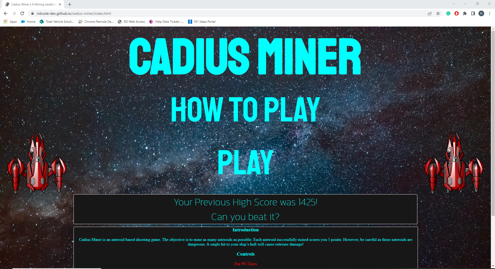
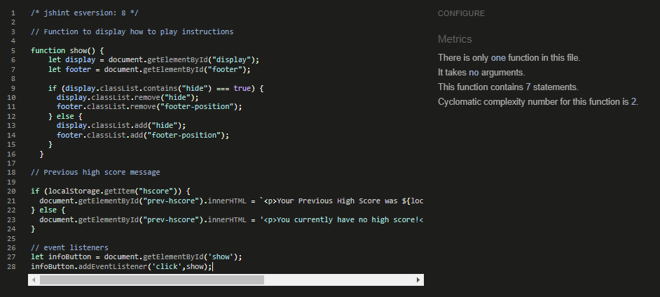
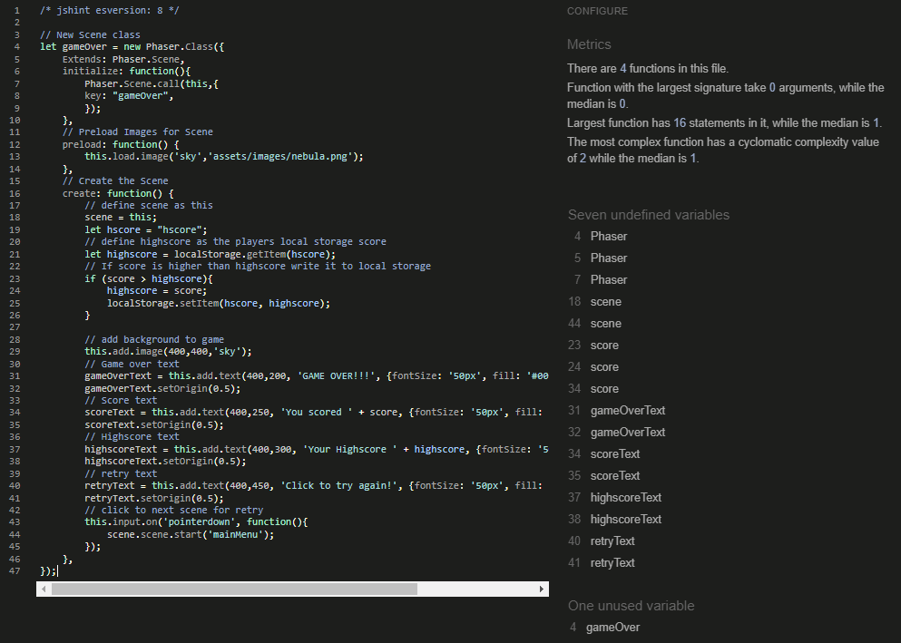
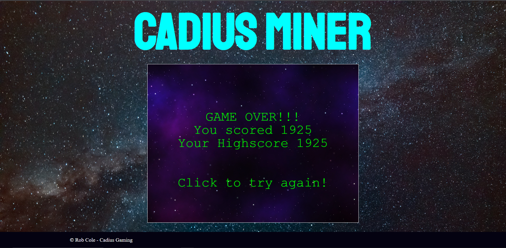

# Testing

Below is a list of test that have been carried out with screenshots.

## Browser Compatibility
The below browsers have been tested with the deployed site.

__Google Chrome__ - Full screen

__Microsoft Edge__ - Tablet Screen

__Firefox__ - Phone Screen

__Samsung Internet App__ - Phone Screen

## Code Validation

__HTML__

No errors were returned when passing through the official W3C Validation

- [W3C validator - Index](https://validator.w3.org/nu/?doc=https://robcole-dev.github.io/cadius-miner/index.html)

 
- [W3C validator - Game](https://validator.w3.org/nu/?doc=https://robcole-dev.github.io/cadius-miner/game.html)

 

__CSS__

No errors were found when passing through the official W3C Validation

- [(Jigsaw) validator](https://jigsaw.w3.org/css-validator/validator?uri=https%3A%2F%2Frobcole-dev.github.io%2Fcadius-miner)

 

__JS__

No errors were found when passing throught the official JS Hint Validation

- Main JS

- Script JS

- Main Menu JS

- Main Game JS

- Game Over JS

## Responsiveness

__Full Screen - 1920x1080__

__Tablet Screen__

__Phone Screen - Samsung A71__

## User Story Tests

- As a user, I would like to see instructions on how to play

- As a user, I want to be able to see my current score while playing the game

- As a user, I want to be able to control when the character fires at the asteroids

- As a user, I want the asteroids to float down from the top of the screen

- As a user, I want a game over screen to appear when I have hit an asteroid

## Fixed Bugs

During development, I ran into some bugs, errors, and issues which I have successfully debugged and troubleshot.

You can find them on the issues tracker on the repository. [Here](https://github.com/robcole-dev/cadius-miner/issues?q=is%3Aissue+is%3Aclosed)

- How To Play button not working (Issue [#1](https://github.com/robcole-dev/cadius-miner/issues/1))
- Crash when clicking play (Issue [#2](https://github.com/robcole-dev/cadius-miner/issues/2))
- Pressing Space bar doesn't shoot (Issue [#3](https://github.com/robcole-dev/cadius-miner/issues/3))

## Unfixed Bugs

Currently there are no bugs that I am aware of.